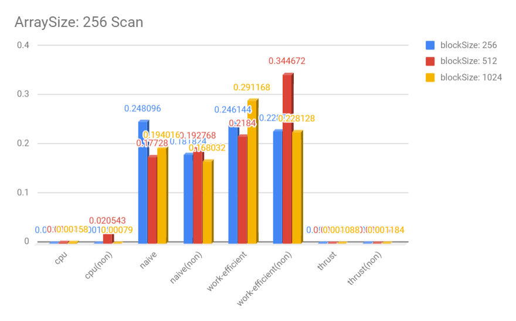
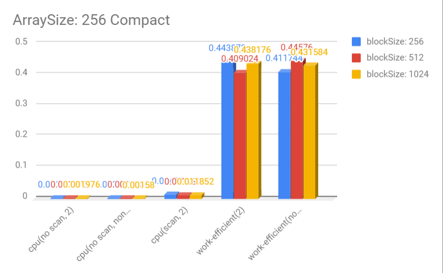
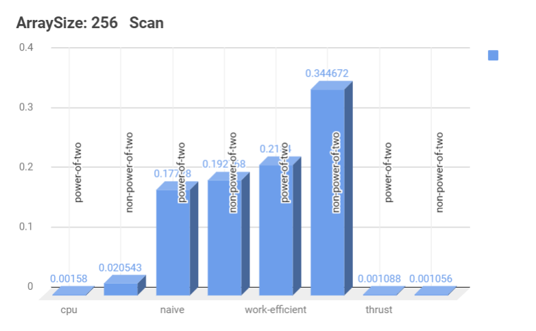
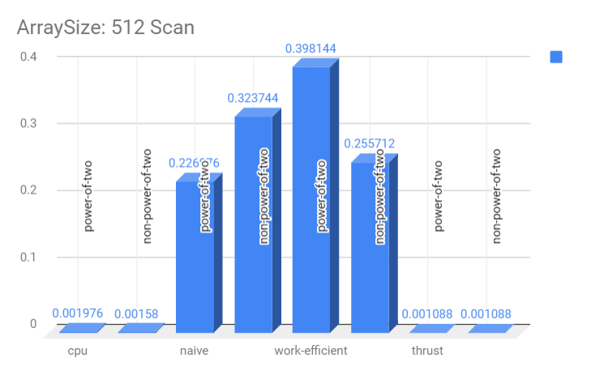
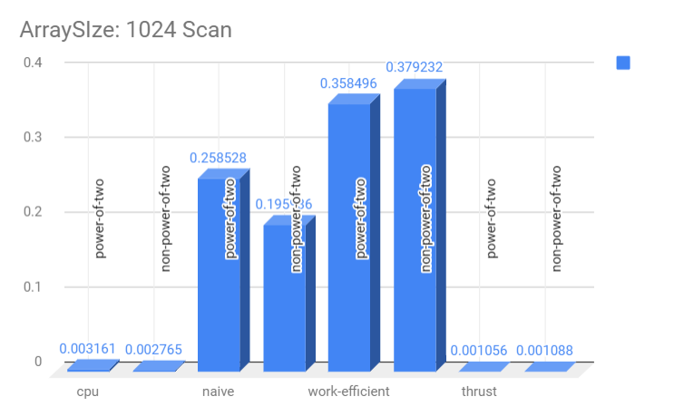
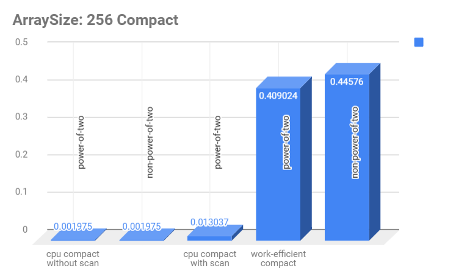
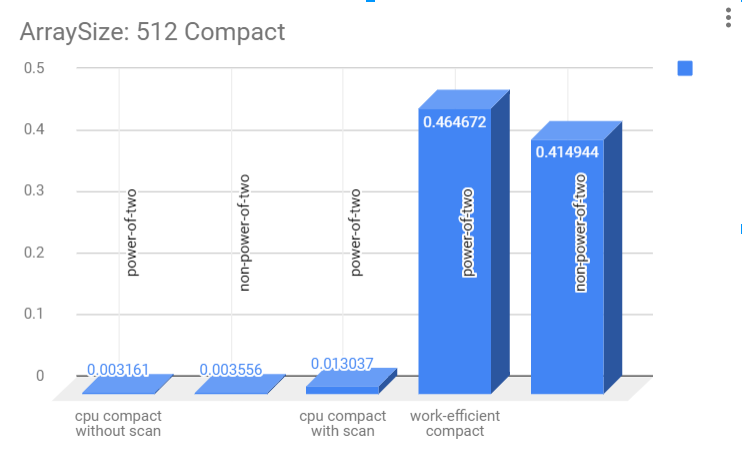
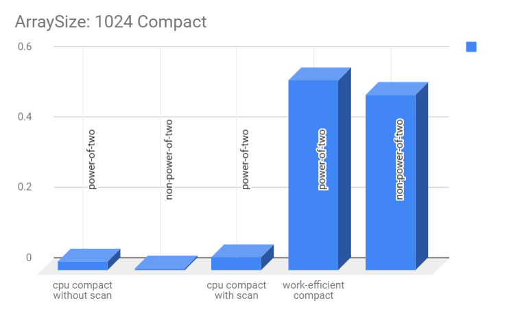

CUDA Stream Compaction
======================

**University of Pennsylvania, CIS 565: GPU Programming and Architecture, Project 2**

* Xinyu Lin
[Linkedin](https://www.linkedin.com/in/xinyu-lin-138352125/)
* Tested on: Windows 10, Intel(R) Core(TM) i7-6700HQ CPU@2.60GHz, 16GB, GTX960M(Private Computer)

### Features

* CPU Scan & Stream Compaction
* Naive GPU Scan Algorithm
* Work-Efficient GPU Scan
* Work-Efficient GPU Stream Compaction
* Thrust Implementation

### Performance Analysis
* BlockSize over Scan methods(ArraySize: 256)


* BlockSize over Compact methods(ArraySize: 256)


* ArraySize over Scan methods(BlockSize: 512)




* ArraySize over Compact methods(BlockSize: 512)




### Result
```
****************
** SCAN TESTS **
****************
    [  33  32  23  11   4  10  29  49   9  36  47  43  19 ...  20   0 ]
==== cpu scan, power-of-two ====
   elapsed time: 0.001185ms    (std::chrono Measured)
    [   0  33  65  88  99 103 113 142 191 200 236 283 326 ... 6332 6352 ]
==== cpu scan, non-power-of-two ====
   elapsed time: 0.001185ms    (std::chrono Measured)
    [   0  33  65  88  99 103 113 142 191 200 236 283 326 ... 6208 6251 ]
    passed
==== naive scan, power-of-two ====
   elapsed time: 0.240992ms    (CUDA Measured)
    passed
==== naive scan, non-power-of-two ====
   elapsed time: 0.189888ms    (CUDA Measured)
    passed
==== work-efficient scan, power-of-two ====
   elapsed time: 0.262976ms    (CUDA Measured)
    passed
==== work-efficient scan, non-power-of-two ====
   elapsed time: 0.228768ms    (CUDA Measured)
    passed
==== thrust scan, power-of-two ====
   elapsed time: 0.001088ms    (CUDA Measured)
    passed
==== thrust scan, non-power-of-two ====
   elapsed time: 0.001088ms    (CUDA Measured)
    passed

*****************************
** STREAM COMPACTION TESTS **
*****************************
    [   1   0   2   2   0   2   3   2   0   0   3   1   0 ...   0   0 ]
==== cpu compact without scan, power-of-two ====
   elapsed time: 0.001975ms    (std::chrono Measured)
    [   1   2   2   2   3   2   3   1   3   2   1   2   1 ...   2   3 ]
    passed
==== cpu compact without scan, non-power-of-two ====
   elapsed time: 0.001976ms    (std::chrono Measured)
    [   1   2   2   2   3   2   3   1   3   2   1   2   1 ...   2   3 ]
    passed
==== cpu compact with scan ====
   elapsed time: 0.008692ms    (std::chrono Measured)
    [   1   2   2   2   3   2   3   1   3   2   1   2   1 ...   2   3 ]
    passed
==== work-efficient compact, power-of-two ====
   elapsed time: 0.499232ms    (CUDA Measured)
    passed
==== work-efficient compact, non-power-of-two ====
   elapsed time: 0.43552ms    (CUDA Measured)
    passed
```
    

  
