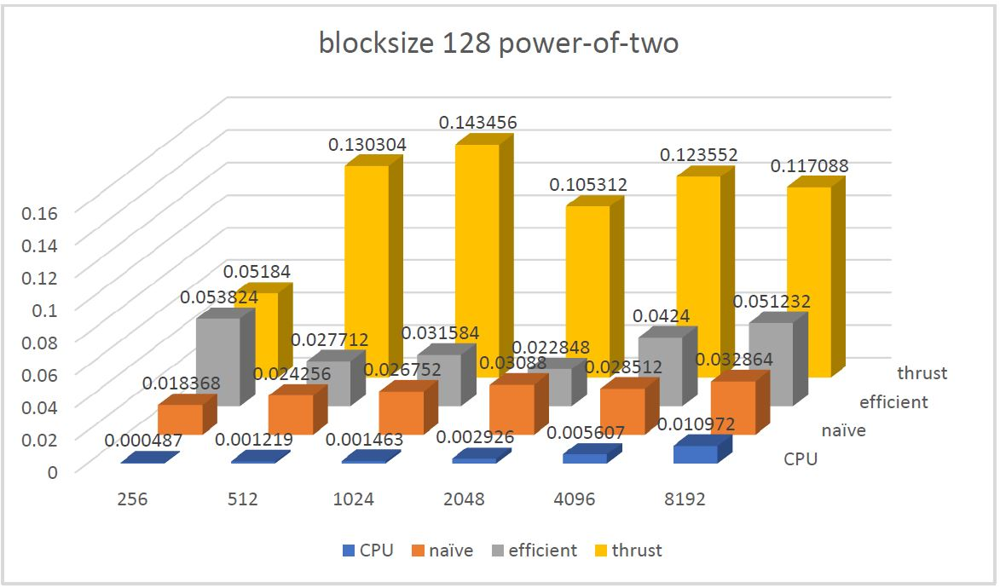
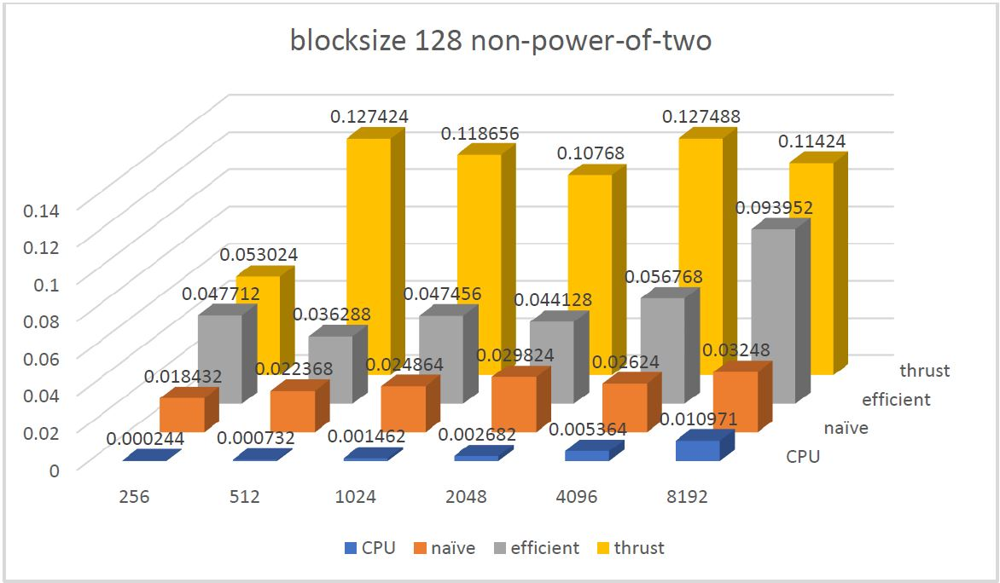

# IT SEEMS MY GPU HAS SOME ISSUE WITH THRUST. BECAUSE I CHANGED CUDA9.2 TO CUDA8.0 BUT THE THRUST SCAN IS STILL SLOW. MY GPU IS GTX 1080. DRIVER VERSION IS 411.63(NEWEST).

CUDA Stream Compaction
======================

**University of Pennsylvania, CIS 565: GPU Programming and Architecture, Project 2**

* Xiao Zhang
  * [LinkedIn](https://www.linkedin.com/in/xiao-zhang-674bb8148/)
* Tested on: Windows 10, i7-7700K @ 4.20GHz 16.0GB, GTX 1080 15.96GB (my own PC)

### Analysis (the pictures shown are the time in millisecond to execute the scan only)

#### Power-of-two



#### Non-power-of-two



### Q&A

#### Write a brief explanation of the phenomena you see here. Can you find the performance bottlenecks? Is it memory I/O? Computation? Is it different for each implementation?

* The first phenomenon is that all GPU algorithm is slower than CPU algorithm. This may be because of there is context changing between GPU and CPU for GPU algorithms whereas there is not for the CPU algorithm. The msvc compiler may also did some optimization to the C++ code.

* The second phenomenon is that efficient GPU algorithm is not faster than naive GPU algorithm. This may be because the naive GPU algorithm contains only one pass and the efficient GPU algorithm contains two pass, and during those two passes, the scheduling is not reliable, which means early termination somehow does not alleviate the idling of some GPU threads. Cache may be another reason why naive algorithm is faster. In naive algorithm, we are accessing the array sequentially, where in efficient algorithm, we are accessing the array with a changing step. Also, we are doing more global reading and writing in the efficienet algorithm.

* The third phenomenon is that thrust scan algorithm is slower than any other algorithm. One possible reason is that the blocksize and gridsize is not set properly and thrust just uses some default value, which is not optimal for my hardware condition. 

* The last phenomenon is that for arrays whose size is a non-power-of-two number, the efficient algorithm suffers alot in terms of performance. This may be becasue my implementation is not optimal. I use cudaMemset to set all the extra elements to zero but if the code just submit the command to GPU and returned immediately, the clock start to tick, the next kernel function is also submitted but the last cudaMemset is still running, then there is still some time before the actual scan algorithm starting to execute. The way that I set the last element of the array to zero after the up sweep kernel is also through cudaMemset. If there is some delay way doing this, it will also affect the performance of the efficient algorithm in general, with non-power-of-two-sized array or not.

### Output

#### Arraysize 256

``` 
****************
** SCAN TESTS **
****************
    [   0  24  44  11   9  38  36  25  14  28  41  25  49 ...  14   0 ]
==== cpu scan, power-of-two ====
   elapsed time: 0.000487ms    (std::chrono Measured)
    [   0   0  24  68  79  88 126 162 187 201 229 270 295 ... 6301 6315 ]
==== cpu scan, non-power-of-two ====
   elapsed time: 0.000244ms    (std::chrono Measured)
    [   0   0  24  68  79  88 126 162 187 201 229 270 295 ... 6179 6221 ]
    passed
==== naive scan, power-of-two ====
   elapsed time: 0.018368ms    (CUDA Measured)
    passed
==== naive scan, non-power-of-two ====
   elapsed time: 0.018432ms    (CUDA Measured)
    passed
==== work-efficient scan, power-of-two ====
   elapsed time: 0.053824ms    (CUDA Measured)
    passed
==== work-efficient scan, non-power-of-two ====
   elapsed time: 0.047712ms    (CUDA Measured)
    passed
==== thrust scan, power-of-two ====
   elapsed time: 0.05184ms    (CUDA Measured)
    passed
==== thrust scan, non-power-of-two ====
   elapsed time: 0.053024ms    (CUDA Measured)
    passed

*****************************
** STREAM COMPACTION TESTS **
*****************************
    [   0   0   0   3   3   0   2   3   2   0   1   3   1 ...   0   0 ]
==== cpu compact without scan, power-of-two ====
   elapsed time: 0.000975ms    (std::chrono Measured)
    [   3   3   2   3   2   1   3   1   2   2   3   1   3 ...   3   1 ]
    passed
==== cpu compact without scan, non-power-of-two ====
   elapsed time: 0.000731ms    (std::chrono Measured)
    [   3   3   2   3   2   1   3   1   2   2   3   1   3 ...   2   3 ]
    passed
==== cpu compact with scan ====
   elapsed time: 0.000975ms    (std::chrono Measured)
    [   3   3   2   3   2   1   3   1   2   2   3   1   3 ...   3   1 ]
    passed
==== work-efficient compact, power-of-two ====
   elapsed time: 0.01984ms    (CUDA Measured)
    [   3   3   2   3   2   1   3   1   2   2   3   1   3 ...   3   1 ]
    passed
==== work-efficient compact, non-power-of-two ====
   elapsed time: 0.048096ms    (CUDA Measured)
    [   3   3   2   3   2   1   3   1   2   2   3   1   3 ...   2   3 ]
    passed
```

#### Arraysize 512

```
****************
** SCAN TESTS **
****************
    [  18  21  27  21   8  35  44   5  29  41  31  26  43 ...   2   0 ]
==== cpu scan, power-of-two ====
   elapsed time: 0.001219ms    (std::chrono Measured)
    [   0  18  39  66  87  95 130 174 179 208 249 280 306 ... 12340 12342 ]
==== cpu scan, non-power-of-two ====
   elapsed time: 0.000732ms    (std::chrono Measured)
    [   0  18  39  66  87  95 130 174 179 208 249 280 306 ... 12322 12334 ]
    passed
==== naive scan, power-of-two ====
   elapsed time: 0.024256ms    (CUDA Measured)
    passed
==== naive scan, non-power-of-two ====
   elapsed time: 0.022368ms    (CUDA Measured)
    passed
==== work-efficient scan, power-of-two ====
   elapsed time: 0.027712ms    (CUDA Measured)
    passed
==== work-efficient scan, non-power-of-two ====
   elapsed time: 0.036288ms    (CUDA Measured)
    passed
==== thrust scan, power-of-two ====
   elapsed time: 0.130304ms    (CUDA Measured)
    passed
==== thrust scan, non-power-of-two ====
   elapsed time: 0.127424ms    (CUDA Measured)
    passed

*****************************
** STREAM COMPACTION TESTS **
*****************************
    [   2   3   3   1   0   3   0   3   3   3   3   2   1 ...   0   0 ]
==== cpu compact without scan, power-of-two ====
   elapsed time: 0.001463ms    (std::chrono Measured)
    [   2   3   3   1   3   3   3   3   3   2   1   2   1 ...   1   2 ]
    passed
==== cpu compact without scan, non-power-of-two ====
   elapsed time: 0.001707ms    (std::chrono Measured)
    [   2   3   3   1   3   3   3   3   3   2   1   2   1 ...   1   1 ]
    passed
==== cpu compact with scan ====
   elapsed time: 0.001951ms    (std::chrono Measured)
    [   2   3   3   1   3   3   3   3   3   2   1   2   1 ...   1   2 ]
    passed
==== work-efficient compact, power-of-two ====
   elapsed time: 0.021376ms    (CUDA Measured)
    [   2   3   3   1   3   3   3   3   3   2   1   2   1 ...   1   2 ]
    passed
==== work-efficient compact, non-power-of-two ====
   elapsed time: 0.08528ms    (CUDA Measured)
    [   2   3   3   1   3   3   3   3   3   2   1   2   1 ...   1   1 ]
    passed
```

#### Arraysize 1024

```
****************
** SCAN TESTS **
****************
    [  14  15  34  28  40  12   1   9  34   5   7  19  38 ...  20   0 ]
==== cpu scan, power-of-two ====
   elapsed time: 0.001463ms    (std::chrono Measured)
    [   0  14  29  63  91 131 143 144 153 187 192 199 218 ... 24828 24848 ]
==== cpu scan, non-power-of-two ====
   elapsed time: 0.001462ms    (std::chrono Measured)
    [   0  14  29  63  91 131 143 144 153 187 192 199 218 ... 24782 24798 ]
    passed
==== naive scan, power-of-two ====
   elapsed time: 0.026752ms    (CUDA Measured)
    passed
==== naive scan, non-power-of-two ====
   elapsed time: 0.024864ms    (CUDA Measured)
    passed
==== work-efficient scan, power-of-two ====
   elapsed time: 0.031584ms    (CUDA Measured)
    passed
==== work-efficient scan, non-power-of-two ====
   elapsed time: 0.047456ms    (CUDA Measured)
    passed
==== thrust scan, power-of-two ====
   elapsed time: 0.143456ms    (CUDA Measured)
    passed
==== thrust scan, non-power-of-two ====
   elapsed time: 0.118656ms    (CUDA Measured)
    passed

*****************************
** STREAM COMPACTION TESTS **
*****************************
    [   2   3   2   0   2   2   3   3   2   3   1   1   2 ...   0   0 ]
==== cpu compact without scan, power-of-two ====
   elapsed time: 0.002195ms    (std::chrono Measured)
    [   2   3   2   2   2   3   3   2   3   1   1   2   1 ...   1   1 ]
    passed
==== cpu compact without scan, non-power-of-two ====
   elapsed time: 0.002438ms    (std::chrono Measured)
    [   2   3   2   2   2   3   3   2   3   1   1   2   1 ...   2   1 ]
    passed
==== cpu compact with scan ====
   elapsed time: 0.003901ms    (std::chrono Measured)
    [   2   3   2   2   2   3   3   2   3   1   1   2   1 ...   1   1 ]
    passed
==== work-efficient compact, power-of-two ====
   elapsed time: 0.021216ms    (CUDA Measured)
    [   2   3   2   2   2   3   3   2   3   1   1   2   1 ...   1   1 ]
    passed
==== work-efficient compact, non-power-of-two ====
   elapsed time: 0.058272ms    (CUDA Measured)
    [   2   3   2   2   2   3   3   2   3   1   1   2   1 ...   2   1 ]
    passed
```

#### Arraysize 2048

```
****************
** SCAN TESTS **
****************
    [  32  17  14   2  39  38  27  46   8   8  40  41  48 ...  48   0 ]
==== cpu scan, power-of-two ====
   elapsed time: 0.002926ms    (std::chrono Measured)
    [   0  32  49  63  65 104 142 169 215 223 231 271 312 ... 49750 49798 ]
==== cpu scan, non-power-of-two ====
   elapsed time: 0.002682ms    (std::chrono Measured)
    [   0  32  49  63  65 104 142 169 215 223 231 271 312 ... 49659 49671 ]
    passed
==== naive scan, power-of-two ====
   elapsed time: 0.03088ms    (CUDA Measured)
    passed
==== naive scan, non-power-of-two ====
   elapsed time: 0.029824ms    (CUDA Measured)
    passed
==== work-efficient scan, power-of-two ====
   elapsed time: 0.022848ms    (CUDA Measured)
    passed
==== work-efficient scan, non-power-of-two ====
   elapsed time: 0.044128ms    (CUDA Measured)
    passed
==== thrust scan, power-of-two ====
   elapsed time: 0.105312ms    (CUDA Measured)
    passed
==== thrust scan, non-power-of-two ====
   elapsed time: 0.10768ms    (CUDA Measured)
    passed

*****************************
** STREAM COMPACTION TESTS **
*****************************
    [   2   1   0   2   1   0   1   2   0   0   2   1   0 ...   0   0 ]
==== cpu compact without scan, power-of-two ====
   elapsed time: 0.004632ms    (std::chrono Measured)
    [   2   1   2   1   1   2   2   1   1   2   2   3   3 ...   3   2 ]
    passed
==== cpu compact without scan, non-power-of-two ====
   elapsed time: 0.004876ms    (std::chrono Measured)
    [   2   1   2   1   1   2   2   1   1   2   2   3   3 ...   2   3 ]
    passed
==== cpu compact with scan ====
   elapsed time: 0.007071ms    (std::chrono Measured)
    [   2   1   2   1   1   2   2   1   1   2   2   3   3 ...   3   2 ]
    passed
==== work-efficient compact, power-of-two ====
   elapsed time: 0.022496ms    (CUDA Measured)
    [   2   1   2   1   1   2   2   1   1   2   2   3   3 ...   3   2 ]
    passed
==== work-efficient compact, non-power-of-two ====
   elapsed time: 0.044096ms    (CUDA Measured)
    [   2   1   2   1   1   2   2   1   1   2   2   3   3 ...   2   3 ]
    passed
```

#### Arraysize 4096

```
****************
** SCAN TESTS **
****************
    [  47   2  37  17  33  33  40  22  29  11  42  36  31 ...  17   0 ]
==== cpu scan, power-of-two ====
   elapsed time: 0.005607ms    (std::chrono Measured)
    [   0  47  49  86 103 136 169 209 231 260 271 313 349 ... 100624 100641 ]
==== cpu scan, non-power-of-two ====
   elapsed time: 0.005364ms    (std::chrono Measured)
    [   0  47  49  86 103 136 169 209 231 260 271 313 349 ... 100522 100558 ]
    passed
==== naive scan, power-of-two ====
   elapsed time: 0.028512ms    (CUDA Measured)
    passed
==== naive scan, non-power-of-two ====
   elapsed time: 0.02624ms    (CUDA Measured)
    passed
==== work-efficient scan, power-of-two ====
   elapsed time: 0.0424ms    (CUDA Measured)
    passed
==== work-efficient scan, non-power-of-two ====
   elapsed time: 0.056768ms    (CUDA Measured)
    passed
==== thrust scan, power-of-two ====
   elapsed time: 0.123552ms    (CUDA Measured)
    passed
==== thrust scan, non-power-of-two ====
   elapsed time: 0.127488ms    (CUDA Measured)
    passed

*****************************
** STREAM COMPACTION TESTS **
*****************************
    [   1   2   3   1   3   3   0   0   3   3   2   0   3 ...   3   0 ]
==== cpu compact without scan, power-of-two ====
   elapsed time: 0.009753ms    (std::chrono Measured)
    [   1   2   3   1   3   3   3   3   2   3   3   1   1 ...   2   3 ]
    passed
==== cpu compact without scan, non-power-of-two ====
   elapsed time: 0.009508ms    (std::chrono Measured)
    [   1   2   3   1   3   3   3   3   2   3   3   1   1 ...   1   2 ]
    passed
==== cpu compact with scan ====
   elapsed time: 0.014873ms    (std::chrono Measured)
    [   1   2   3   1   3   3   3   3   2   3   3   1   1 ...   2   3 ]
    passed
==== work-efficient compact, power-of-two ====
   elapsed time: 0.049856ms    (CUDA Measured)
    [   1   2   3   1   3   3   3   3   2   3   3   1   1 ...   2   3 ]
    passed
==== work-efficient compact, non-power-of-two ====
   elapsed time: 0.09104ms    (CUDA Measured)
    [   1   2   3   1   3   3   3   3   2   3   3   1   1 ...   1   2 ]
    passed
```

#### Arraysize 8192

```
****************
** SCAN TESTS **
****************
    [  49  14  14  29  11  26  29   9  23  49  26  45  40 ...  15   0 ]
==== cpu scan, power-of-two ====
   elapsed time: 0.010972ms    (std::chrono Measured)
    [   0  49  63  77 106 117 143 172 181 204 253 279 324 ... 200832 200847 ]
==== cpu scan, non-power-of-two ====
   elapsed time: 0.010971ms    (std::chrono Measured)
    [   0  49  63  77 106 117 143 172 181 204 253 279 324 ... 200773 200788 ]
    passed
==== naive scan, power-of-two ====
   elapsed time: 0.032864ms    (CUDA Measured)
    passed
==== naive scan, non-power-of-two ====
   elapsed time: 0.03248ms    (CUDA Measured)
    passed
==== work-efficient scan, power-of-two ====
   elapsed time: 0.051232ms    (CUDA Measured)
    passed
==== work-efficient scan, non-power-of-two ====
   elapsed time: 0.093952ms    (CUDA Measured)
    passed
==== thrust scan, power-of-two ====
   elapsed time: 0.117088ms    (CUDA Measured)
    passed
==== thrust scan, non-power-of-two ====
   elapsed time: 0.11424ms    (CUDA Measured)
    passed

*****************************
** STREAM COMPACTION TESTS **
*****************************
    [   1   2   0   1   3   2   1   1   1   3   0   3   2 ...   1   0 ]
==== cpu compact without scan, power-of-two ====
   elapsed time: 0.016335ms    (std::chrono Measured)
    [   1   2   1   3   2   1   1   1   3   3   2   1   3 ...   1   1 ]
    passed
==== cpu compact without scan, non-power-of-two ====
   elapsed time: 0.017066ms    (std::chrono Measured)
    [   1   2   1   3   2   1   1   1   3   3   2   1   3 ...   3   3 ]
    passed
==== cpu compact with scan ====
   elapsed time: 0.026332ms    (std::chrono Measured)
    [   1   2   1   3   2   1   1   1   3   3   2   1   3 ...   1   1 ]
    passed
==== work-efficient compact, power-of-two ====
   elapsed time: 0.106496ms    (CUDA Measured)
    [   1   2   1   3   2   1   1   1   3   3   2   1   3 ...   1   1 ]
    passed
==== work-efficient compact, non-power-of-two ====
   elapsed time: 0.059904ms    (CUDA Measured)
    [   1   2   1   3   2   1   1   1   3   3   2   1   3 ...   3   3 ]
    passed
```
